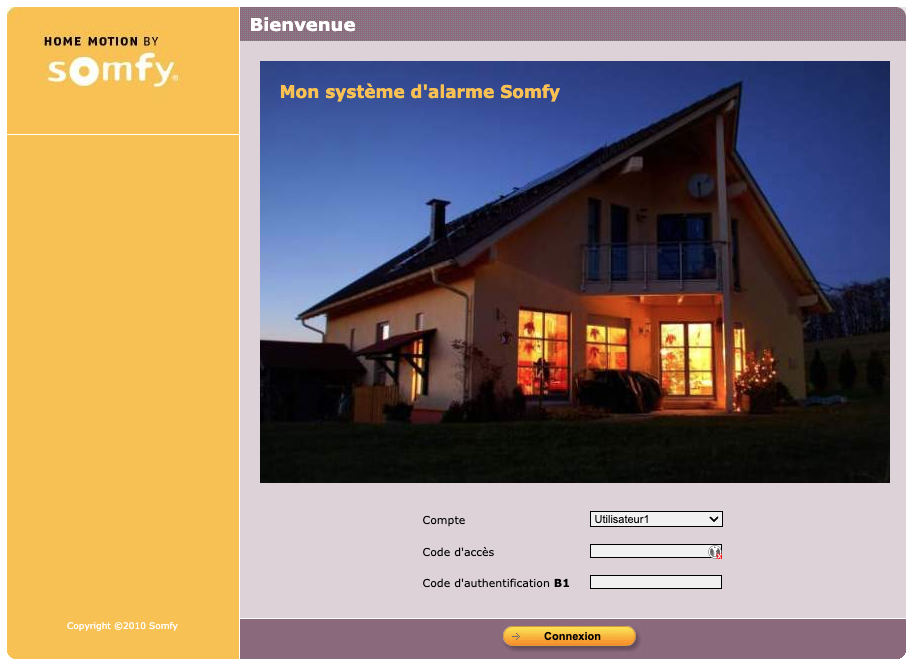
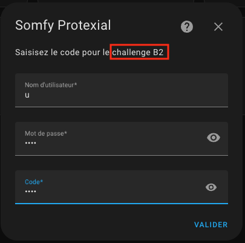
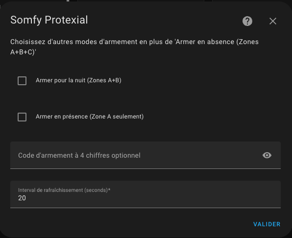

# Somfy Protexial / Protexiom / Protexial IO

[![GitHub Release][releases-shield]][releases]
[![License][license-shield]](LICENSE)

## À propos

🔀 Cette version 2.0.0 est un [Fork](https://github.com/the8tre/somfy-protexial) **de l’intégration originale**.

Cette intégration gère l'interface avec une centrale d'alarme Somfy Protexial, Protexiom ou Protexial IO.

Modèles testés :
| Modèle         | Version         | Statut             |
| -------------- | --------------- | ------------------ |
| Protexial IO   | `2013 (v10_13)` | :white_check_mark: |
| Protexiom 5000 | `2013 (v10_3)`  | :white_check_mark: |
| Protexiom      | `2013 (v10_15)` | :white_check_mark: |
| Protexiom ?    | `2013 (v10_14)` | :white_check_mark: |
| Protexial      | `2010 (v8_1)`   | :white_check_mark: |
| Protexiom      | `2008`          | :white_check_mark: |

Modèles testés **pour la liste des éléments** et leur status associés :
| Modèle         | Version         | Statut             |
| -------------- | --------------- | ------------------ |
| Protexiom ?    | `2013 (v10_14)` | :white_check_mark: |
| Protexiom      | `2013 (v10_15)` | :white_check_mark: |

L'intégration permet le pilotage:

- de l'alarme par zones (A, B, C)
- des volets roulants
- des lumières

#### Les entités suivantes sont gérées (v1.2.4 et v1.2.6)
| Entité                              | Description                                                 | Version                                                    |
| ----------------------------------- | ----------------------------------------------------------- |-----------------------------------------------------------|
| `alarm_control_panel.alarme`        | Support des modes `armed_away`, `armed_home`, `armed_night` | 1.2.4                                                     |
| `cover.volets`                      | Ouverture, fermeture et arrêt. Pas de contrôle de position. | 1.2.4                                                      |
| `light.lumieres`                    | Allumé ou éteint (état maintenu par l'intégration).         | 1.2.4                                                      |
| `binary_sensor.batterie`            | Etat aggrégé des batteries des éléments.                    | 1.2.4                                                      |
| `binary_sensor.boitier`             | Etat du boitier.                                            | 1.2.4                                                      |
| `binary_sensor.communication_radio` | Etat de la communication radio.                             | 1.2.4                                                      |
| `binary_sensor.communication_gsm`   | Etat de la communication GSM.                               | 1.2.4                                                      |
| `binary_sensor.mouvement_detecte`   | Etat de détection de mouvement.                             | 1.2.4                                                      |
| `binary_sensor.porte_ou_fenetre`    | Etat d'ouvertue de porte ou fenêtre.                        | 1.2.4                                                      |
| `binary_sensor.camera`              | Etat de connexion de la caméra.                             | 1.2.4                                                      |
| `sensor.signal_gsm_5`               | Puissance du signal GSM (/5)                                |[1.2.6](https://github.com/the8tre/somfy-protexial/pull/73) |
| `sensor.operateur_gsma`             | Opérateur GSM                                               |[1.2.6](https://github.com/the8tre/somfy-protexial/pull/73) |

#### Les entités (sensors) suivants sont créées avec des attributs (attributes) et représente la liste des éléments de l'alarme (v2.0.0) :
| Entité                              | Description -  Attributs                                                                                 | Version |
| ----------------------------------- | -------------------------------------------------------------------------------------------------------- | --------|
| `binary_sensor.do_ouvt_xxx`         | Ouverture de porte - Attributs batterie, lien avec la centrale, erreur, arrachement, ouvert/fermé, pause | 2.0.0   |
| `binary_sensor.do_vitre_ouvt_xxx`   | Ouverture de fenêtre avec détection de bris de vitre - Attributs batterie, lien avec la centrale, erreur, arrachement, ouvert/fermé, pause                    | 2.0.0   |
| `binary_sensor.do_gar_xxx`          | Ouverture de porte de garage - Attributs batterie, lien avec la centrale, erreur, arrachement, ouvert/fermé, pause                    | 2.0.0   |
| `binary_sensor.dm_image_mvt_xxx`    | Détecteur de mouvements avec prise d'imagesAttributs batterie, lien avec la centrale, erreur, arrachement, pause               | 2.0.0   |
| `binary_sensor.dm_mvt_xxx`          | Détecteur de mouvements - Attributs batterie, lien avec la centrale, erreur, arrachement, pause               | 2.0.0   |
| `binary_sensor.tr_tel_xxx`          | Centrale - Attributs batterie, lien avec la centrale, erreur, arrachement, pause               | 2.0.0   |
| `binary_sensor.clavier_clv_xxx`     | Clavier - Attributs batterie, lien avec la centrale, erreur, arrachement, pause               | 2.0.0   |
| `binary_sensor.cl_lcd_clv_xxx`      | Clavier avec écran LCD - Attributs batterie, lien avec la centrale, erreur, arrachement, pause               | 2.0.0   |  
| `binary_sensor.sir_ext_xxx`         | Sirène extérieure - Attributs batterie, lien avec la centrale, erreur, arrachement, pause               | 2.0.0   |  
| `binary_sensor.sir_int_xxx`         | Sirène intérieure - Attributs batterie, lien avec la centrale, erreur, arrachement, pause               | 2.0.0   |  
| `binary_sensor.d_fumee_fumee_xxx`   | Détecteur de fumée - Attributs batterie, lien avec la centrale, erreur, pause                            | 2.0.0   |  
| `binary_sensor.tc_multi_tlcmd_xxx`  | Télécommande multi canaux - Attributs lien avec la centrale, pause                                              | 2.0.0   |
| `binary_sensor.tc_4_tlcmd_xxx`      | Télécommande alarme multi zones - Attributs lien avec la centrale, pause                                              | 2.0.0   |
| `binary_sensor.badge_bdg_axxx   `   | Badge - Attributs lien avec la centrale, pause                                              | 2.0.0   |

## Installation

### Option A: Installation via HACS (recommandé)

1. Ajouter ce repository GitHub à HACS
   -  ou manuellement
   - HACS :arrow_right: Intégrations :arrow_right: Menu '...' :arrow_right: Dépôts personnalisés
   - Dépôt: `https://github.com/AuroreVgn/somfy-protexial`
   - Catégorie: `Intégration`
2. Télécharger l'intégration
   - HACS :arrow_right: Intégrations :arrow_right: Somfy Protexial :arrow_right: Télécharger
3. Redémarrer Home Assistant

### Option B: Installation manuelle

1. Télécharger l'archive de la dernière version disponible: [somfy_protexial.zip](https://github.com/AuroreVgn/somfy-protexial/archive/refs/tags/2.0.0.zip)
2. Localiser le répertoire contenant le fichier `configuration.yaml` dans votre installation de HA
3. Si il n'y a pas de répertoire `custom_components` le créer
4. Créer un répertoire `somfy_protexial` dans `custom_components`
5. Extraire le contenu de `somfy_protexial.zip` dans le répertoire `somfy_protexial`
6. Redémarrer Home Assistant

## Configuration

- Ajouter l'intégration: 
   
  ou manuellement
- Paramètres :arrow_right: Appareils et services :arrow_right: + Ajouter une intégration :arrow_right: Somfy Protexial

### 1. Adresse de la centrale

- Saisisser l'URL de l'interface web locale de votre centrale: `http://192.168.1.234` ou `http://192.168.1.234:9876`
  

### 2. Identifiants de l'utilisateur

- Utilisateur : `"u"`, conserver la valeur pré-remplie
- Mot de passe : Saisir le mot de passe habituellement utilisé
- Code : Saisir le code de la carte d'authentification correspondant au challenge demandé
  

### 3. Configuration additionelle

Les différents modes d'armement exploitent les zones définies par la configuration de la centrale Somfy:

- Armement en absence (toujours configuré) : Zones A+B+C
- Armement pour la nuit (optionnel) : Zones au choix (A, B, C, A+B, B+C, A+C)
- Armement en présence (optionnel) : Zones au choix (A, B, C, A+B, B+C, A+C)

Code d'armement: Si vous spécifiez un code celui-ci sera demandé lors de l'armement/désarmement.

Interval de rafraîchissement: de 15 secondes à 1 heure, 60 secondes par défaut.

## À noter

### Compatibilité de version

La liste visible en haut de cette page n'est pas exhaustive, il est tout à fait possible que cette intégration soit compatible avec d'autres version de centrale Somfy. N'hésitez pas à m'en faire part si c'est le cas !

👉🏻Un fil de discussion à ce sujet est disponible ici: [HACF - Intégration Custom: Centrale Somfy Protexial](https://forum.hacf.fr/t/integration-custom-centrale-somfy-protexial/23589/1)

L'année de l'interface de votre centrale apparait en bas des pages: 

Certaines centrales fournissent leur version via cette url : http://192.168.1.234/cfg/vers ou http://192.168.1.234:9876/cfg/vers

### Utilisation de l'interface web d'origine

⚠️ La centrale ne gérant qu'une seule session utilisateur à la fois il est nécesaire de désactiver temporairement l'intégration si vous voulez pouvoir utiliser l'interface web.

### Utilisation de l'application mobile d'origine

⚠️ L'utilisation de l'application mobile 'Somfy Alarme' reste possible même avec l'intégration active.

### Re-configuration de l'intégration

L'intégration supporte la re-configuration à partie de l'interface graphique.

## Les contributions sont les bienvenues !
If you want to contribute to this please read the [Contribution guidelines](CONTRIBUTING.md)

## Credits
Code template was mainly taken from [@Ludeeus](https://github.com/ludeeus)'s [integration_blueprint][integration_blueprint] template

---

[integration_blueprint]: https://github.com/custom-components/integration_blueprint
[hacs]: https://hacs.xyz
[hacsbadge]: https://img.shields.io/badge/HACS-Custom-orange.svg?style=flat-square
[license-shield]: https://img.shields.io/github/license/the8tre/somfy-protexial.svg?style=flat-square
[maintenance-shield]: https://img.shields.io/badge/maintainer-%40the8tre-blue.svg?style=flat-square
[releases-shield]: https://img.shields.io/github/v/release/AuroreVgn/somfy-protexial.svg?style=flat-square
[releases]: https://github.com/AuroreVgn/somfy-protexial/releases
[user_profile]: https://github.com/AuroreVgn
