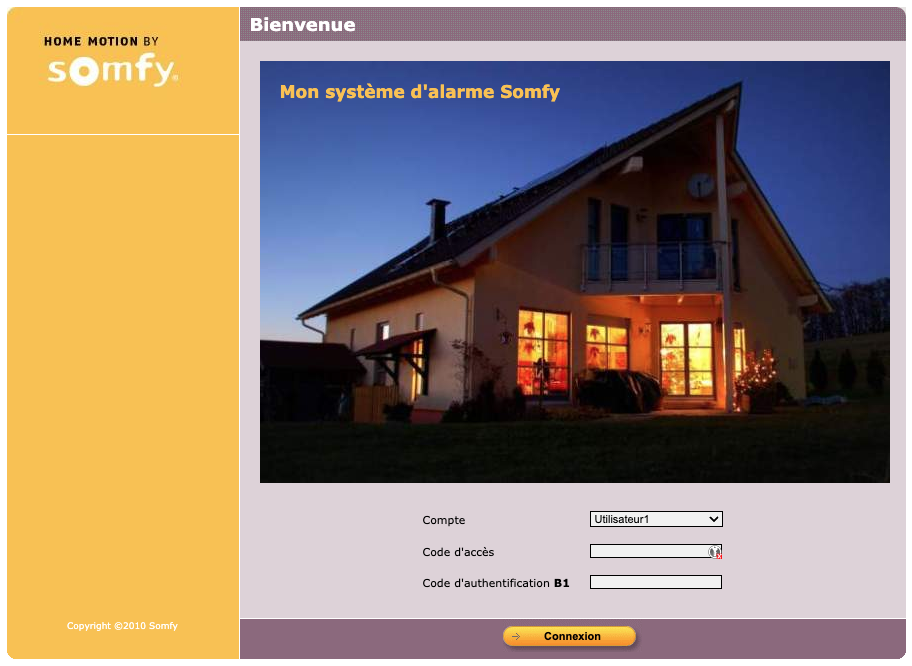
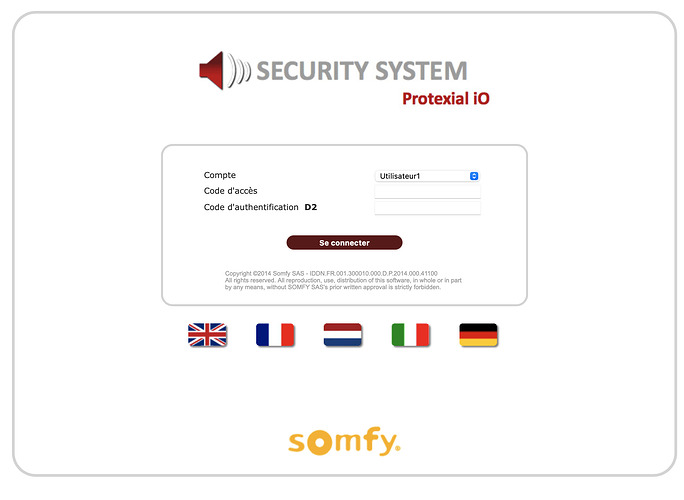
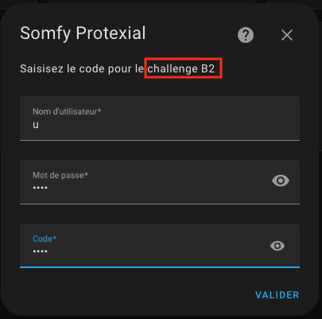

# Somfy Protexial / Protexiom / Protexial IO

[![GitHub Release][releases-shield]][releases]
[![License][license-shield]](LICENSE)
[](https://github.com/hacs/integration)
[](#)
[](https://ko-fi.com/aurorevgn)


## ☕️ Soutenir le projet

Si cette intégration vous est utile et que vous souhaitez soutenir son développement et sa maintenance :

<p>
  <a href="https://ko-fi.com/aurorevgn">
    
  </a>
</p>

## 🌍 Other languages

[English](README.en.md) | [Deutsch](README.de.md) | [Español](README.es.md) | [Italiano](README.it.md) | [Nederlands](README.nl.md) | [Português](README.pt.md)

## 🔐 À propos

Cette intégration permet d'utiliser une centrale d'alarme **Somfy Protexial, Protexiom ou Protexial IO directement dans Home Assistant**.

🔀 La branche 2.2.x est un [fork](https://github.com/the8tre/somfy-protexial) maintenu et enrichi de l'intégration originale de [the8tre](https://github.com/the8tre), désormais archivée.

Le projet vise notamment à prolonger la durée de vie de ces centrales et à anticiper :

- 📵 [l'arrêt de la 2G](https://github.com/AuroreVgn/somfy-protexial/wiki/Arr%C3%AAt-de-la-2G-et-des-serveurs-alarmsomfy.eu-%E2%80%90-%C3%A9tude-d'impact-et-solution), en permettant de remplacer une partie des alertes GSM par des notifications Home Assistant, y compris des alertes critiques
- ☁️ l'évolution ou l'arrêt des services distants historiques Somfy, l'intégration communiquant directement avec la centrale sur le réseau local

> [!TIP]
> 📚 La documentation détaillée, les guides, automatisations et solutions de dépannage sont regroupés dans le **[Wiki du projet](https://github.com/AuroreVgn/somfy-protexial/wiki)**.

## ✨ Fonctionnalités principales

L'intégration permet notamment :

- 🚨 le pilotage de l'alarme et des zones A, B et C ;
- 🪟 le pilotage des volets roulants ;
- 💡 le pilotage des lumières ;
- 🚪 la remontée des détecteurs et de leurs états ;
- 🔋 le suivi des piles et des défauts ;
- 📡 le diagnostic des communications radio et GSM ;
- 🔃 la réinitialisation des défauts d'alarme, de liaison et de piles ;
- ⏸️ la mise en pause et la réactivation d'éléments compatibles pour leur maintenance ;
- 🔄 un intervalle de rafraîchissement modifiable dynamiquement ;
- ⚙️ la lecture et la modification de certains paramètres généraux de la centrale ;
- 🕐 la lecture et la synchronisation de la date et de l'heure ;
- 📜 la consultation des événements récents de la centrale.

➡️ **[Consulter la liste complète des entités et fonctionnalités](https://github.com/AuroreVgn/somfy-protexial/wiki/Entit%C3%A9s-et-fonctionnalit%C3%A9s)**

## 🛡️ Compatibilité

Plusieurs générations de centrales **Protexial, Protexiom et Protexial IO**, de 2008 à 2013, ont fait l'objet de retours concluants.

L'absence d'un modèle dans la liste ne signifie pas qu'il est incompatible : il peut simplement ne pas avoir encore été testé ou documenté.

### 🌍 Langues de l'interface de la centrale

L'intégration détecte automatiquement la langue utilisée par l'interface web de la centrale.

Les interfaces Somfy actuellement prises en charge sont :

| Langue | Préfixe |
| --- | --- |
| 🇫🇷 Français | `/fr/` |
| 🇩🇪 Allemand | `/de/` |
| 🇬🇧 Anglais | `/gb/` |
| 🇪🇸 Espagnol | `/sp/` |
| 🇮🇹 Italien | `/it/` |
| 🇳🇱 Néerlandais | `/nl/` |

La langue de l'interface de la centrale est indépendante de la langue utilisée dans Home Assistant.


➡️ **[Consulter les modèles et versions testés](https://github.com/AuroreVgn/somfy-protexial/wiki/Compatibilit%C3%A9-des-centrales)**

## 📦 Installation

### Option A — HACS (recommandé)

Ajoutez directement le dépôt à HACS :

[](https://my.home-assistant.io/redirect/hacs_repository/?category=integration&repository=somfy-protexial&owner=AuroreVgn)

Ou manuellement :

1. ouvrez **HACS → Intégrations → ⋮ → Dépôts personnalisés** ;
2. ajoutez `https://github.com/AuroreVgn/somfy-protexial` ;
3. choisissez la catégorie **Intégration** ;
4. téléchargez **Somfy Protexial** ;
5. redémarrez Home Assistant.

### Option B — Installation manuelle

1. Téléchargez l'archive de la [dernière release](https://github.com/AuroreVgn/somfy-protexial/releases/latest).
2. Dans le répertoire contenant `configuration.yaml`, créez si nécessaire `custom_components`.
3. Créez `custom_components/somfy_protexial`.
4. Placez-y le contenu du composant `somfy_protexial`.
5. Redémarrez Home Assistant.

> [!TIP]
> Besoin d'installer ou de tester une ancienne version ? Consultez **[Télécharger une version précise de l'intégration](https://github.com/AuroreVgn/somfy-protexial/wiki/T%C3%A9l%C3%A9charger-une-version-pr%C3%A9cise-de-l'int%C3%A9gration)**.

## ⚙️ Configuration

Vous pouvez lancer directement l'ajout de l'intégration :

[](https://my.home-assistant.io/redirect/config_flow_start/?domain=somfy_protexial)

Ou depuis :

**Paramètres → Appareils et services → Ajouter une intégration → Somfy Protexial**

### 1. Adresse de la centrale

Saisissez l'adresse locale de l'interface web, par exemple :

```text
http://192.168.1.234
```

ou avec un port personnalisé :

```text
http://192.168.1.234:9876
```



### 2. Compte Utilisateur

Renseignez :

- **Utilisateur** : `u` dans la plupart des cas ; conservez la valeur proposée par l'intégration ;
- **Mot de passe** : le mot de passe utilisé pour accéder à la centrale ;
- **Code** : le code de la carte d'authentification correspondant au challenge affiché.



### 3. Options principales

Les modes d'armement utilisent les zones définies dans la centrale :

- **Absence** : A+B+C ;
- **Nuit** : combinaison de zones configurable ;
- **Présence** : combinaison de zones configurable.

**Code d'armement :** si un code est configuré, il reste requis pour le désarmement. L'option **Code requis pour l'armement** détermine s'il doit également être demandé lors de l'armement.

**Intervalle de rafraîchissement :** configurable de `0` à 86 400 secondes, avec 60 secondes par défaut. La valeur `0` désactive l'actualisation automatique ; le bouton **Actualiser les données** permet alors de lancer une synchronisation manuelle.

> [!WARNING]
> Un intervalle très court sollicite fortement l'ancienne interface web de la centrale. Il n'est pas recommandé de descendre inutilement sous la valeur par défaut.

➡️ **[Optimiser la fréquence de rafraîchissement et la durée de vie des piles](https://github.com/AuroreVgn/somfy-protexial/wiki/Optimisation-de-la-dur%C3%A9e-de-vie-des-piles-de-la-Centrale)**

### 4. Compte Installateur — optionnel

Le compte **Installateur** n'est pas nécessaire au pilotage normal de l'alarme.

Il permet d'accéder aux fonctions qui nécessitent des droits supplémentaires, notamment :

- ⏸️ pause et réactivation des éléments compatibles ;
- ⚙️ certains paramètres généraux de la centrale ;
- 🕐 lecture et synchronisation de la date et de l'heure.

➡️ **[Pause et maintenance des éléments](https://github.com/AuroreVgn/somfy-protexial/wiki/Pause-et-maintenance-des-%C3%A9l%C3%A9ments)**

## 📚 Documentation

Le Wiki regroupe la documentation détaillée afin de garder ce README volontairement simple.

| Guide | Description |
| --- | --- |
| 📡 [Entités et fonctionnalités](https://github.com/AuroreVgn/somfy-protexial/wiki/Entit%C3%A9s-et-fonctionnalit%C3%A9s) | Entités, attributs, boutons, paramètres et fonctions |
| 🛡️ [Compatibilité](https://github.com/AuroreVgn/somfy-protexial/wiki/Compatibilit%C3%A9-des-centrales) | Centrales et générations testées |
| 📵 [Arrêt de la 2G et des services Somfy](https://github.com/AuroreVgn/somfy-protexial/wiki/Arr%C3%AAt-de-la-2G-et-des-serveurs-alarmsomfy.eu-%E2%80%90-%C3%A9tude-d'impact-et-solution) | Impacts et solutions avec Home Assistant |
| 🔋 [Optimisation des piles](https://github.com/AuroreVgn/somfy-protexial/wiki/Optimisation-de-la-dur%C3%A9e-de-vie-des-piles-de-la-Centrale) | Rafraîchissement court, variable ou désactivé |
| ⏸️ [Pause et maintenance](https://github.com/AuroreVgn/somfy-protexial/wiki/Pause-et-maintenance-des-%C3%A9l%C3%A9ments) | Maintenance des équipements |
| 📜 [Journal des événements](https://github.com/AuroreVgn/somfy-protexial/wiki/Journal-des-%C3%A9v%C3%A9nements) | Événements récents de la centrale |
| 🚨 [Détection d'intrusions](https://github.com/AuroreVgn/somfy-protexial/wiki/D%C3%A9tection-d'intrusions,-comment-faire-%3F) | Exemples d'automatisations |
| 🎨 [Dashboard](https://github.com/AuroreVgn/somfy-protexial/wiki/Dashboard) | Cartes et exemples Lovelace |
| 🐛 [Mode débug](https://github.com/AuroreVgn/somfy-protexial/wiki/Mode-d%C3%A9bug) | Activer les logs détaillés |
| ❓ [FAQ & dépannage](https://github.com/AuroreVgn/somfy-protexial/wiki/FAQ-et-d%C3%A9pannage) | Problèmes fréquents et diagnostic |

➡️ **[Accéder au Wiki complet](https://github.com/AuroreVgn/somfy-protexial/wiki)**

## 🎨 Carte Lovelace

Une carte Lovelace dédiée a été développée pour afficher et piloter facilement l'alarme :

➡️ **[somfy-protexial-card](https://github.com/developpeurbox/somfy-protexial-card)** par [developpeurbox](https://github.com/developpeurbox)

D'autres exemples de dashboards sont disponibles dans la **[page Dashboard du Wiki](https://github.com/AuroreVgn/somfy-protexial/wiki/Dashboard)**.

## ⚠️ À savoir

### Interface web Somfy

La centrale ne gère qu'une seule session utilisateur à la fois.

> [!IMPORTANT]
> Si vous souhaitez utiliser directement l'interface web d'origine avec le même compte, il peut être nécessaire de désactiver temporairement l'intégration.

### Application mobile Somfy

L'intégration Home Assistant fonctionne localement et n'a pas besoin des serveurs Somfy pour ses fonctions principales.

Pour les conséquences de l'évolution des services historiques Somfy et de la 2G :

➡️ **[Étude d'impact et solutions](https://github.com/AuroreVgn/somfy-protexial/wiki/Arr%C3%AAt-de-la-2G-et-des-serveurs-alarmsomfy.eu-%E2%80%90-%C3%A9tude-d'impact-et-solution)**

### Reconfiguration

L'intégration prend en charge la reconfiguration depuis l'interface graphique de Home Assistant.

## 🆘 Aide et support

Avant de signaler un problème, consultez la **[FAQ](https://github.com/AuroreVgn/somfy-protexial/wiki/FAQ-et-d%C3%A9pannage)** et, si nécessaire, activez le **[mode débug](https://github.com/AuroreVgn/somfy-protexial/wiki/Mode-d%C3%A9bug)**.

- 🐛 [Issues GitHub](https://github.com/AuroreVgn/somfy-protexial/issues)
- 💬 [Discussion HACF](https://forum.hacf.fr/t/integration-custom-centrale-somfy-protexial/23589/1)

## 🤝 Contributions

Les contributions et retours sur d'autres générations de centrales sont les bienvenus.

➡️ [Contribution guidelines](CONTRIBUTING.md)


## 🙏 Crédits

Cette version est issue du projet original de [the8tre](https://github.com/the8tre/somfy-protexial).

Le code a également été basé sur l'[integration_blueprint][integration_blueprint] de [@Ludeeus](https://github.com/ludeeus).

---

[integration_blueprint]: https://github.com/custom-components/integration_blueprint
[license-shield]: https://img.shields.io/github/license/the8tre/somfy-protexial.svg?style=flat-square
[releases-shield]: https://img.shields.io/github/v/release/AuroreVgn/somfy-protexial.svg?style=flat-square
[releases]: https://github.com/AuroreVgn/somfy-protexial/releases
