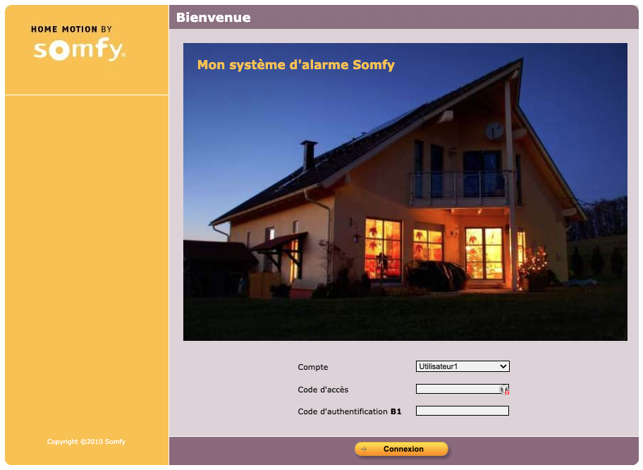
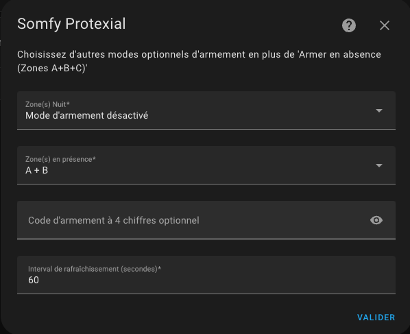

# Somfy Protexial / Protexiom

[![GitHub Release][releases-shield]][releases]
[![License][license-shield]](LICENSE)

[![Project Maintenance][maintenance-shield]][user_profile]

## À propos

Cette intégration gère l'interface avec une centrale d'alarme Somfy Protexial ou Protexiom et permet le pilotage:

- de l'alarme par zones (A+B+C, A+B, A)
- des volets roulants
- des lumières

Les entités suivantes sont gérées:
| Entité                              | Description                                                 |
| ----------------------------------- | ----------------------------------------------------------- |
| `alarm_control_panel.alarme`        | Support des modes `armed_away`, `armed_home`, `armed_night` |
| `cover.volets`                      | Ouverture, fermeture et arrêt. Pas de contrôle de position. |
| `light.lumieres`                    | Allumé ou éteint (état maintenu par l'intégration).         |
| `binary_sensor.batterie`            | Etat aggrégé des batteries des éléments.                    |
| `binary_sensor.boitier`             | Etat du boitier.                                            |
| `binary_sensor.communication_radio` | Etat de la communication radio.                             |
| `binary_sensor.communication_gsm`   | Etat de la communication GSM.                               |
| `binary_sensor.mouvement_detecte`   | Etat de détection de mouvement.                             |
| `binary_sensor.porte_ou_fenetre`    | Etat d'ouvertue de porte ou fenêtre.                        |
| `binary_sensor.camera`              | Etat de connexion de la caméra.                             |



## Installation

- Ajouter l'intégration: 
   ou manuellement
- Paramètres :arrow_right: Appareils et services :arrow_right: + Ajouter une intégration :arrow_right: Somfy Protexial



## Configuration

### 1. Adresse de la centrale

- Saisisser l'URL de l'interface web locale de votre centrale: `http://192.168.1.234`
  

### 2. Identifiants de l'utilisateur

- Utilisateur: `"u"`, conserver la valeur pré-remplie
- Mot de passe: Saisir le mot de passe habituellement utilisé
- Code: Saisir le code de la carte d'authentification correspondant au challenge demandé
  

### 3. Configuration additionelle

Les différents modes d'armement exploitent les zones définies par la cofiguration de la centrale Somfy:

- Armement en absence (toujours configuré): Zones A+B+C
- Armement pour la nuit (optionnel): Zones A+B
- Armement en présence (optionnel): Zones A

Code d'armement: Si vous spécifiez un code celui-ci sera demandé lors de l'armement/désarmement.

Interval de rafraîchissement: de 15 secondes à 1 heure, 20 secondes par défaut.

## À noter

### Compatibilité de version

Il est tout à fait possible que cette intégration soit compatible avec d'autres version de centrale Somfy telle que Protexiom. N'hésitez pas à m'en faire part si c'est le cas !
| Modèle         | Version        | Statut             |
| -------------- | -------------- | ------------------ |
| Protexial      | `2010 (v8_1)`  | :white_check_mark: |
| Protexiom 5000 | `2013 (v10_3)` | :white_check_mark: |
| Protexiom      | `2008`         | :white_check_mark: |
| Protexiom      | `v?*?`         | :grey_question:    |

L'année de l'interface de votre centrale apparait en bas des pages: 

Certaines centrales fournissent leur version via cette url: http://192.168.1.234/cfg/vers

### Utilisation de l'interface web d'origine

La centrale ne gérant qu'une seule session utilisateur à la fois il est nécesaire de désactiver temporairement l'intégration si vous voulez pouvoir utiliser l'interface web.

### Re-configuration de l'intégration
L'intégration supporte la re-configuration à partie de l'interface graphique.

## Les contributions sont les bienvenues !

If you want to contribute to this please read the [Contribution guidelines](CONTRIBUTING.md)

## Credits

This project was generated from [@oncleben31](https://github.com/oncleben31)'s [Home Assistant Custom Component Cookiecutter](https://github.com/oncleben31/cookiecutter-homeassistant-custom-component) template.

Code template was mainly taken from [@Ludeeus](https://github.com/ludeeus)'s [integration_blueprint][integration_blueprint] template

---

[integration_blueprint]: https://github.com/custom-components/integration_blueprint
[hacs]: https://hacs.xyz
[hacsbadge]: https://img.shields.io/badge/HACS-Custom-orange.svg?style=flat-square
[license-shield]: https://img.shields.io/github/license/the8tre/somfy-protexial.svg?style=flat-square
[maintenance-shield]: https://img.shields.io/badge/maintainer-%40the8tre-blue.svg?style=flat-square
[releases-shield]: https://img.shields.io/github/release/the8tre/somfy-protexial.svg?style=flat-square
[releases]: https://github.com/the8tre/somfy-protexial/releases
[user_profile]: https://github.com/the8tre
